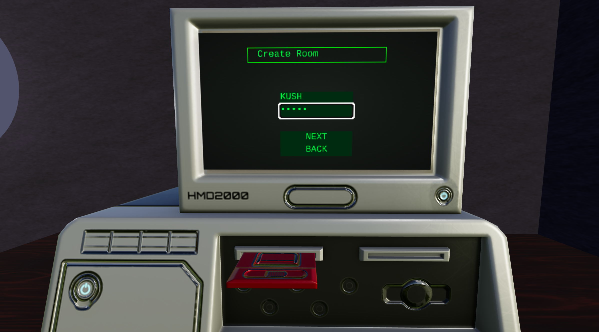

# 🦑 typeFight  

a not needed two player typing game.  
built for pain, and accidental learning.  

not a productivity tool.  
not a shitty tutorial-followed project.  
just raw websockets, redis, and some free time.  

---

## ⚙️tech stack  
- 3js (for that cool retro themed 3d landing environment)
- react (for unicorn like frontend)  
- node.js (backjoint's pain)  
- tailwind (for makeup of that unicorn)  
- zustand (some eazy state management)  
- redis (where all my bugs go to hide)  

[frontend] ⇆ [websocket] ⇆ [backend] ⇆ [redis]  

---

## 🧩 how it works -   
- every word = token → sent to backend  
- space/enter acts as “word token” checkpoint  
- backend judges you like the old gaming days → dumps state into redis(to reconnect) + a local roomManager  
- u type shit instant L at the backend using  *Levenshtein distance* (a jargon to just check the no of diff chars in two strings).  
- real-time opponent cursor updates in the form of ghost cursor to give esports like feel.
- ping of both the players to make it feel as authentic as her :)  

---

## 😮‍💨 logs (things that ruined my mood)  
- storing the uuid in local storage; god its debug → 2-3 days of staring at codebase, doubting existence, removed the whole restart feature.. thinking it was the problem but..
- turns out it wasn’t my code, it was local storage being a clingy bastard (persistent storage per tab + window)  
- learned nothing except just verify don't assume.  
- works fine with diff browsers or an incognito on the same browser 
- things never go as planned, majority of the features in the  game were never planned
- front-end bugs are difficult to solve; atleast for my dumbazz$

---

## 🐛bed-bugs  
- reconnect works… until it doesn’t, i cant just fix frontend; its not my cup of tea;
- on reconnect, the timer resets and starts again as it uses react state instead of zustand + i could have done it but i feel dumb doing front-end + it works kinda so mind not;
- this is a *learning project*, some game to be played by a village of minions , it has bugs because I am not [god’s chosen programmer like him](https://www.youtube.com/watch?v=YPSza4zN4H4)  

---

## why this ? 🕹️  
- monkeytype doesn't have multiplayer, other sites are too cartoon-ish. (who am i to say)  
- i am not a code monkey who does leetcode; (real proj>> lol)  
- “todo apps” bana lu kya ab as a good proj?  

so yeah. i wish i could have said i brought a revolution but all i bought is some confidence that yeah i can pull off websockets and redis. ahem ahem!  :)

---

## LICENSE📜
do whatever.  
steal, fork, rewrite in bf, idc.  
but if you turn this into a startup → i’ll curse your code with gypsy errors.  
See [LICENSE](./LICENSE) file for full details.

